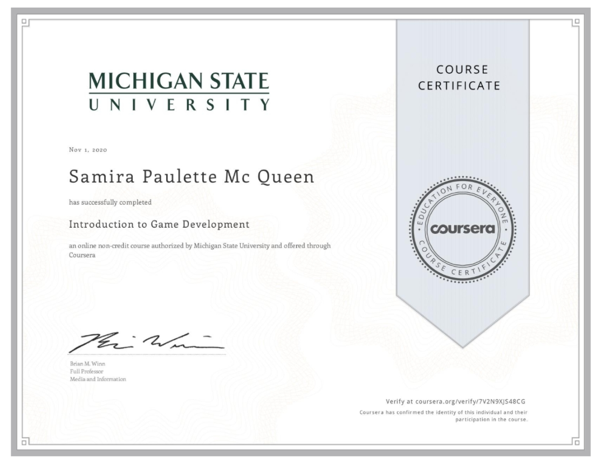
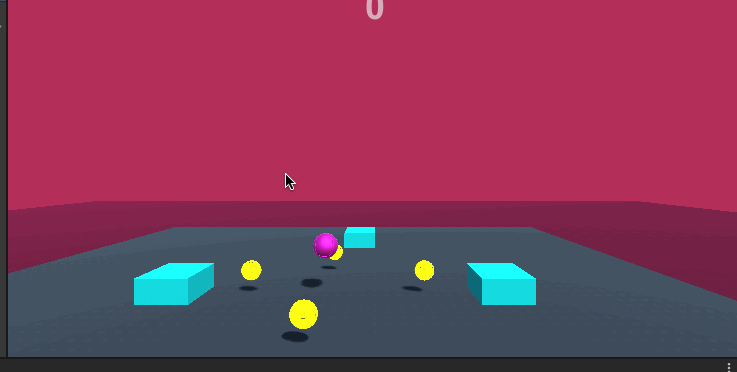

# Introduction to Game Development
This project was done in my Coursera Specialization Course

# Roller Madness
Unity game called Roller Madness. The player control's a ball to dodge enemies and pick up coins.
 Player has to pick up a certain amount of coins to go on to the next level before the enemies catch you.

# About the Author
Name: Samira Mc Queen
[LinkedIn](https://www.linkedin.com/in/samira-mc-queen-1882431a7/)

Free Spririted Caribbean Woman.
Software Developer and aspiring Game Developer

# Project 

## Experience with Project
- This was my 2nd project while doing the course and i've been loving it
- Creating this game became challenging at first as the course was progressing and getting deeper into the langauge and the Unity platform

# Game Features
- Two levels
- Player has the option to play again or to go to the next level once the first level is beat
- Player bounce off of the platform
- Player collects points
- Player can die from enemy attack

# Language
- C Sharp

# Platform
- Unity

# Game Play
First download the repository locally on your device
- For Mac go to this part of the project and run the game 
``
(box-shooter/Build/Mac/Mac-Build.app/)
``

Enjoy! :) 

